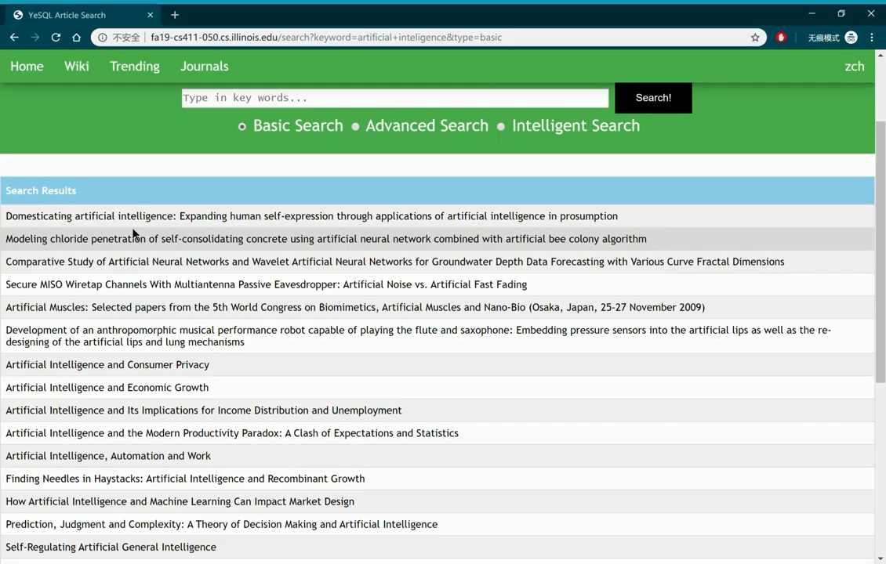
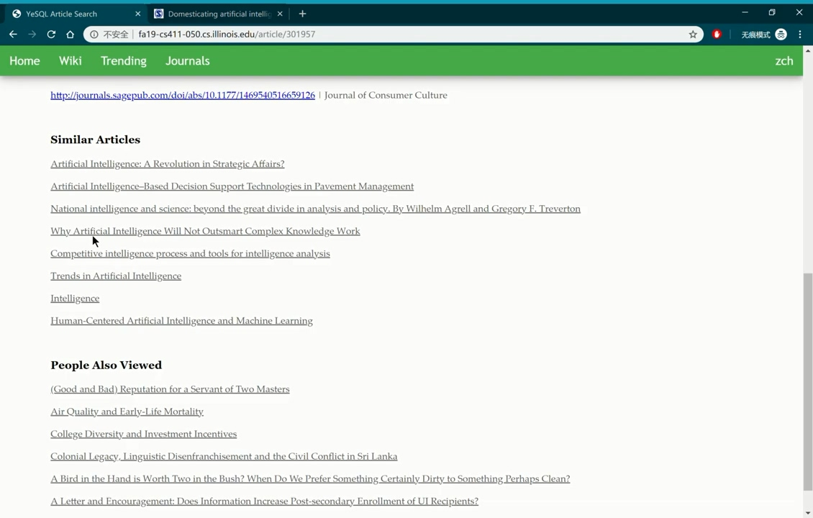

# yesql_app
Web Journal Recommender. Fall 19 group course project.

This a journal searching web application based on Python Flask and MySQL. The journal data are provided by course staff.

Visitors of the web applications can search articles and add those articles to their favorite lists if they have signed in.

The application supports REST API and **fuzzy search**.




## Deployment Instructions

First make sure that you have python3 and pip3 installed.

Next, install virtualenv if you haven't
```
$ pip3 install virtualenv
```

In project folder, run
```
$ virtualenv -p python3 venv
```
to initialize python virtual environment.

Activate virtual environment with:
```
$ source ./venv/bin/activate
```

Install required modules in venv
```
(venv)$ pip install -r requirements.txt
```
App is ready to run:
```
(venv)$ python app.py
```
Visit `http://127.0.0.1:5000` to view it locally.

## Unit Testing

Run:
```sh
(venv)$ python -m unittest test.mysql
```

## Database Description
Our main database in MySQL is "pj" (short for project).
The backup database for "pj" is called "pj_backup".
The descriptions of each table in "pj" are below.  

Table "jid_name"

| Field | Type | Null | Key | Default | Extra |
| --- | --- | --- | --- | --- | --- |
| journal_id   | int(11)      | NO   | PRI | NULL    | auto_increment |
| journal_name | varchar(255) | NO   |     | NULL    |       |

Table "jid_field"

| Field | Type | Null | Key | Default | Extra |
| --- | --- | --- | --- | --- | --- |
| journal_id | int(11)      | NO   | PRI | NULL    | FGN jid_name.journal_id       |
| field      | varchar(255) | NO   | PRI | NULL    |       |

Table "jsubj_fd"

| Field | Type | Null | Key | Default | Extra |
| --- | --- | --- | --- | --- | --- |
| subject | varchar(255) | NO   | PRI |         |       |
| field   | varchar(255) | NO   | PRI |         |       |

Table "j_nmfdrk"

| Field | Type | Null | Key | Default | Extra |
| --- | --- | --- | --- | --- | --- |
| journal_name | varchar(255) | NO   | PRI |         |       |
| field        | varchar(255) | NO   | PRI |         |       |
| ranking      | int(11)      | YES  |     | NULL    |       |
